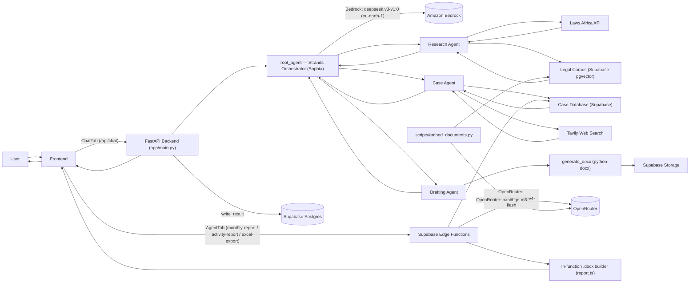

```mermaid
flowchart LR
    User[User] --> Frontend[Frontend]

    %% Chat / drafting path — Strands agent on Bedrock
    Frontend -- "ChatTab (/api/chat)" --> FastAPI["FastAPI Backend (app/main.py)"]
    FastAPI --> Orchestrator["root_agent — Strands Orchestrator (Sophia)"]
    Orchestrator -- "Bedrock: deepseek.v3-v1:0 (eu-north-1)" --> Bedrock[("Amazon Bedrock")]

    Orchestrator --> ResearchAgent["Research Agent"]
    Orchestrator --> CaseAgent["Case Agent"]
    Orchestrator --> DraftingAgent["Drafting Agent"]

    ResearchAgent --> LawsAfrica["Laws Africa API"]
    LawsAfrica --> ResearchAgent
    ResearchAgent --> Corpus["Legal Corpus (Supabase pgvector)"]
    Corpus --> ResearchAgent

    CaseAgent --> CaseDB["Case Database (Supabase)"]
    CaseDB --> CaseAgent
    CaseAgent --> Tavily["Tavily Web Search"]
    Tavily --> CaseAgent

    DraftingAgent --> DocXGen["generate_docx (python-docx)"]
    DocXGen --> Storage["Supabase Storage"]

    ResearchAgent --> Orchestrator
    CaseAgent --> Orchestrator
    DraftingAgent --> Orchestrator

    FastAPI -- write_result --> Supabase[("Supabase Postgres")]
    FastAPI --> Frontend

    %% Report generation path — Supabase Edge Functions on OpenRouter
    Frontend -- "AgentTab (monthly-report / activity-report / excel-export)" --> EdgeFn["Supabase Edge Functions"]
    EdgeFn -- "OpenRouter: deepseek/deepseek-v4-flash" --> OpenRouter[("OpenRouter")]
    EdgeFn --> CaseDB
    EdgeFn --> DocxBuilder["In-function .docx builder (report.ts)"]
    DocxBuilder --> Frontend

    %% Embeddings
    EmbedPipeline["scripts/embed_documents.py"] -- "OpenRouter: baai/bge-m3" --> OpenRouter
    EmbedPipeline --> Corpus

    Frontend --> User
```
